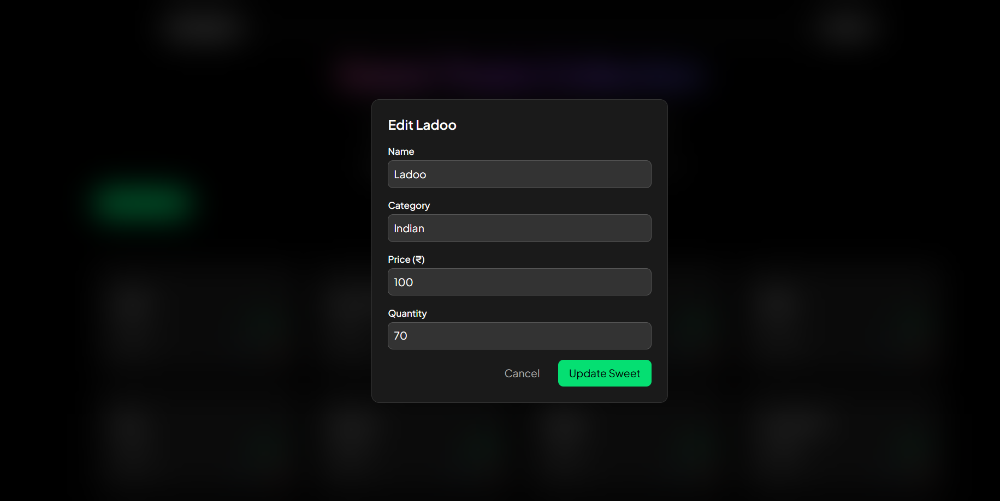

# Sweet Shop Management System

This project is a **full-stack web application** for managing a sweet shop inventory, built using **React (frontend)**, **Node.js + Express + Prisma (backend)**, and **PostgreSQL (database)**.  
It provides user authentication, sweets listing with search and filters, purchasing for users, and admin features for adding, editing, restocking, and deleting sweets.

The project supports two ways to run the application:
- **Local Development:** Run frontend and backend separately with npm.
- **Docker Compose:** Fully dockerized setup for easy deployment with a single command.

---

## 📂 Project Structure

```
.
├── client/             # React Frontend (Vite + TypeScript)
│   ├── src/            # Source code
│   │   ├── components/ # React components (SweetCard, SweetsDisplay, SweetAddForm)
│   │   ├── services/   # RTK Query APIs (sweetApi, api)
│   │   └── types/      # TypeScript types (sweets.types, user.types)
│   ├── Dockerfile      # Frontend Dockerfile
│   ├── .env.example    # Environment variables template
│   ├── package.json
│   └── vite.config.ts
├── server/             # Node.js + Express + Prisma Backend
│   ├── src/            # Source code
│   │   ├── auth/       # API Routes, Controllers and Business logic of Auth
│   │   ├── sweets/     # API Routes, Controllers and Business logic of Sweets
│   │   ├── config/     # Config for prisma client and passport
        ├── common/     # Common for middlewares and helper functions
│   │   └── middleware/ # Middleware (auth, role-auth)
│   ├── prisma/         # Prisma schema and migrations
│   │   └── schema.prisma
│   ├── Dockerfile      # Backend Dockerfile
│   ├── package.json
│   ├── .env.example    # Environment variables template
│   └── seed.ts         # Database seeder for users and sweets
├── docker-compose.yml  # Docker Compose configuration
└── README.md           # Project Documentation
```

---

# Local Development Setup

To run the project locally without Docker, follow these steps.

## **1. Prerequisites**
- Node.js (v18 or higher)
- PostgreSQL (running locally or remotely)
- npm or yarn

## **2. Setup Database**
- Install PostgreSQL and create a database (e.g., `sweetdb`).
- Update `server/.env` with your `DATABASE_URL`:
  ```
  DATABASE_URL="postgresql://postgres:Ashibhatt123@@localhost:5432/AIKata?schema=public"
  ACCESS_TOKEN_SECRET=AccessSecret@
  REFRESH_TOKEN_SECRET=RefreshSecret@
  PORT=5000
  ```

## **3. Backend Setup**
```bash
  cd server
  npm install
  npx prisma generate
  npx prisma migrate deploy
  npx prisma db seed  # Run seed.ts for initial data
  npm start
```
- Backend runs on `http://localhost:5000`.

## **4. Frontend Setup**
```bash
  cd client
  npm install
  npm run dev
```
- Frontend runs on `http://localhost:5173`.

---

# Dockerized Setup (Recommended)

The project is fully dockerized using Docker Compose for easy setup. It includes services for the frontend, backend, and PostgreSQL database.

## **1. Prerequisites**
- Docker and Docker Compose installed.


## **2. Start the Application**
```bash
docker compose up --build -d
```
This command:
- Builds and starts the frontend (React) on `http://localhost:3000`.
- Builds and starts the backend (Node.js/Express) on `http://localhost:5000`.
- Starts PostgreSQL on `localhost:5432` with your custom credentials.
- Automatically runs Prisma migrations and seeds the database.

## **3. Stop the Application**
```bash
docker compose down
```
To reset the database:
```bash
docker compose down -v
```

## **4. View Logs**
```bash
docker compose logs -f
```

---

---

# Application URLs

| Service    | URL                                            |
| ---------- | ---------------------------------------------- |
| Frontend   | [http://localhost:3000](http://localhost:3000) |
| Backend    | [http://localhost:5000](http://localhost:5000/api) |

---

# Login Credentials

| email              | password                         |
| ------------------ | ---------------------------------|
|  user@example.com    | userpassword123                  |
|  admin@example.com   | adminpassword123                 |

---

# 🛠 Troubleshooting

### **1. Error: `@prisma/client did not initialize yet`**
Run:
```bash
docker exec -it backend npx prisma generate
```

### **2. Container Restart Loop**
Check logs:
```bash
docker compose logs backend
```
Common issues: Invalid `DATABASE_URL` or missing `.env` variables.

### **3. Rebuild Everything**
```bash
docker compose down -v
docker compose up --build -d
```

### **4. Database Connection Issues**
- Ensure PostgreSQL credentials in `.env` are correct.
- Verify the `db` service is running: `docker ps`.
- Test connection: `docker exec -it backend psql ${DATABASE_URL}`.

---

# Features
- **User Authentication**: Register, login, JWT-based auth.
- **Sweets Management**:
  - List all sweets with search, filters (name, category, price range).
  - Purchase sweets (decreases quantity).
  - Admin-only: Add, edit, restock, delete sweets.
- **Frontend**: Responsive UI with modals for purchase, edit, restock, delete.
- **Backend**: RESTful APIs with role-based access (ADMIN/USER).
- **Database**: PostgreSQL with Prisma ORM, seeded with sample users (admin/user) and sweets.

# Technologies
- **Frontend**: React, Vite, TypeScript, RTK Query, Tailwind CSS, Framer Motion, Lucide Icons, React Hook Form, Yup.
- **Backend**: Node.js, Express, Prisma, JWT.
- **Database**: PostgreSQL.
- **Deployment**: Docker Compose.

# Screenshots
- **Homepage (Sweets List with Search/Filters) for Users**: 
- **Homepage (Admin View with Add/Edit/Restock/Delete)**: 
- **Purchase Modal**: 
- **Admin Add Modal**: 
- **Admin Edit Modal**: 
- **Admin Restock Modal**: 
- **Admin Delete Modal**: 
---

# My AI Usage
I used Grok (built by xAI) as an AI assistant throughout the development process.

- **Tools Used**: Grok for code generation, debugging, and suggestions.
- **How I Used Them**:
  - Used Grok to generate initial boilerplate for React components (e.g., SweetCard, SweetAddForm) and backend routes (e.g., sweets.routes.ts).
  - Asked Grok for help with RTK Query setup for API endpoints and Prisma schema design.
  - Utilized Grok to create modals, form validation with Yup, and role-based access logic.
  - Grok assisted in dockerizing the project with Docker Compose, including dynamic .env handling for PostgreSQL credentials.
  - Debugged issues like premature redirects in ProtectedRoute and SweetAddForm using Grok's suggestions.
  - Grok generated the updated README.md structure and content.
- **Reflection**: Using Grok significantly accelerated development by providing quick code snippets and debugging tips, allowing focus on architecture and integration. It improved workflow efficiency but required manual refinements for project-specific needs. Transparency in commits (co-authored by Grok) ensured clear AI contributions.